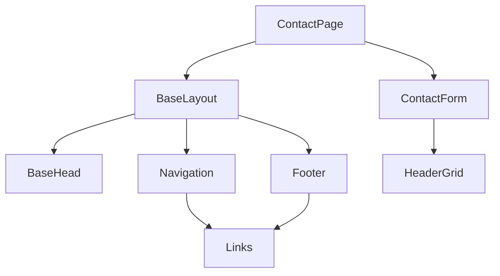

# System Patterns: Fluidity AI Website

## Architecture
The Fluidity AI website is built using Astro.js, a modern static site generator that allows for fast page loads and a great developer experience. The site follows a component-based architecture, with reusable components for common elements like navigation, footer, and forms.

## Key Technical Decisions
- **Astro.js**: Chosen for its performance benefits and ability to ship minimal JavaScript
- **Tailwind CSS**: Used for styling, providing a utility-first approach that makes it easy to create consistent designs
- **SendGrid**: Used for email processing from the contact form
- **Component Structure**: Organized into global components, page-specific components, and layouts

## Design Patterns
- **Component-Based Architecture**: The site is built using reusable components
- **Responsive Design**: All pages and components are designed to work well on all screen sizes
- **Progressive Enhancement**: Core functionality works without JavaScript, with enhanced features when JavaScript is available

## Component Relationships

## Form Handling
- Contact form submissions are processed using Formspree
- Form validation occurs client-side before submission
- Formspree handles the email delivery
- Success and error states are handled gracefully with user feedback
